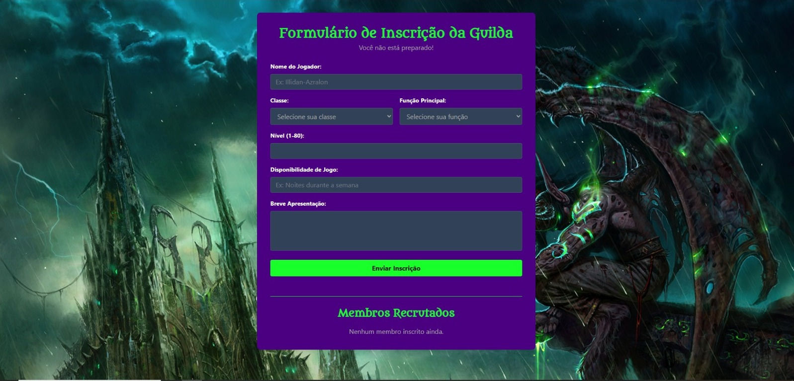

# Formulário de Guilda

Este projeto é uma aplicação web front-end que apresenta um formulário de recrutamento para uma guilda. Foi desenvolvido como um estudo prático para solidificar conceitos de desenvolvimento de interfaces com React e estilização moderna utilizando Tailwind CSS.

## �️ Preview

Abaixo está uma prévia de como o formulário se parece em um dispositivo desktop.



## �🚀 Funcionalidades

- **Interface Moderna:** Design limpo e agradável construído com Tailwind CSS.
- **Responsividade:** O layout se adapta a diferentes tamanhos de tela, de dispositivos móveis a desktops.
- **Componentização:** A estrutura do formulário é organizada em componentes React reutilizáveis, como visto em `FormularioGuilda.jsx`.
- **Integração com Google Sheets:** As inscrições enviadas pelo formulário são salvas automaticamente em uma planilha do Google Sheets através de um Google Apps Script, funcionando como um "backend" simples e eficaz.

## 🛠️ Tecnologias Utilizadas

A lista de tecnologias principais usadas no desenvolvimento deste projeto:

- **React:** Biblioteca JavaScript para construir interfaces de usuário.
- **Tailwind CSS:** Framework CSS utility-first para estilização rápida e customizável.
- **Vite:** Ferramenta de build moderna que oferece uma experiência de desenvolvimento mais rápida.
- **JavaScript (ES6+):** Linguagem de programação base da aplicação.

## 📂 Estrutura do Projeto

A estrutura de pastas principal do projeto está organizada da seguinte forma:

```
formulario-guilda/
├── public/
│   └── # Arquivos estáticos
├── src/
│   ├── assets/
│   │   └── # Imagens, fontes, etc.
│   ├── components/
│   │   └── FormularioGuilda.jsx # Componente principal do formulário
│   ├── App.jsx                  # Componente raiz da aplicação
│   └── main.jsx                 # Ponto de entrada da aplicação
├── .gitignore
├── index.html
├── package.json
└── README.md
```

## ⚙️ Como Executar o Projeto

Para rodar este projeto localmente, siga os passos abaixo:

1.  **Clone o repositório:**
    `git clone <URL_DO_REPOSITORIO>`
2.  **Navegue até o diretório do projeto:**
    `cd formulario-guilda`
3.  **Instale as dependências:**
    `npm install`
4.  **Inicie o servidor de desenvolvimento:**
    `npm run dev`

Após executar os comandos, a aplicação estará disponível em `http://localhost:5173` (ou outra porta indicada no terminal).